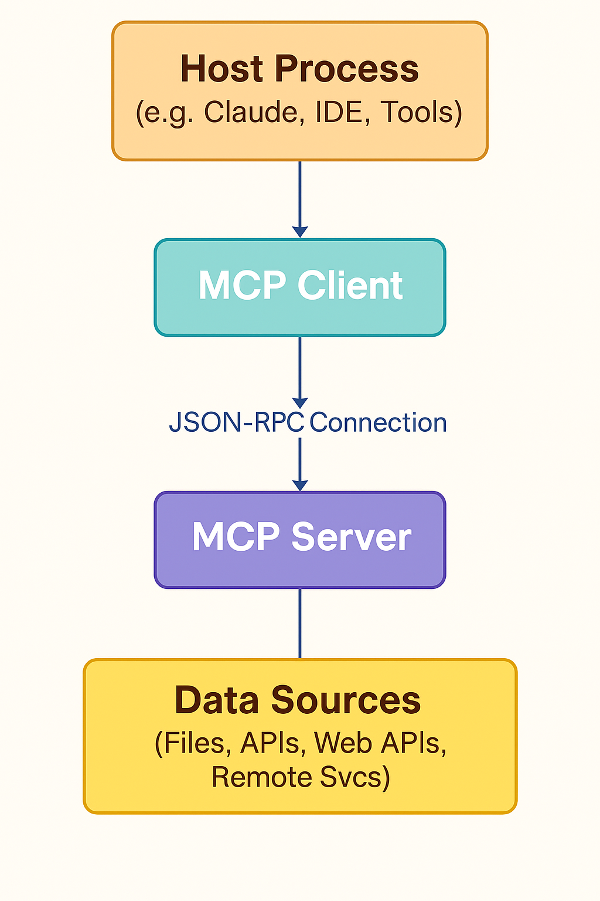

# 🔗 Model Context Protocol (MCP) Overview

The **Model Context Protocol (MCP)** is an open protocol that standardizes how applications provide context to large language models (LLMs). Think of MCP like a USB-C port for AI: it offers a universal way to connect AI models to various data sources and tools.

---

## 🚀 Why Use MCP?

- **Plug-and-Play Integrations:** Easily connect your LLM to a growing list of pre-built integrations.
- **Provider Flexibility:** Switch between LLM vendors without changing your integration approach.
- **Security Best Practices:** Keep your data secure within your own infrastructure.

---

## 🏗️ MCP Architecture

  

MCP uses a client-server architecture, allowing host applications to connect to multiple servers and data sources:

- **MCP Hosts:** Apps like Claude Desktop, IDEs (VS Code), or AI tools accessing data via MCP.
- **MCP Clients:** Maintain 1:1 connections with MCP servers.
- **MCP Servers:** Lightweight programs exposing capabilities through MCP.
- **Local Data Sources:** Files, databases, and services on your computer.
- **Remote Services:** External APIs and internet services.

This setup lets LLMs and AI tools securely access both local and remote data, enabling powerful, context-aware AI applications.

---

## 🚦 Getting Started with MCPs

To help code-to-cloud teams quickly leverage the Model Context Protocol, we’ve curated a list of recommended MCP servers that can boost your development productivity. These servers provide ready-to-use integrations with common data sources, tools, and services.

Explore the submodule below for setup instructions, usage examples, and best practices:

- [**Getting Started with MCP Servers**](getting_started_with_mcp.md)  
  *A curated guide to installing, configuring, and using popular MCP servers for rapid integration with your LLM workflows.*

---

**Learn more:** [Model Context Protocol Introduction](https://modelcontextprotocol.io/introduction#general-architecture)
